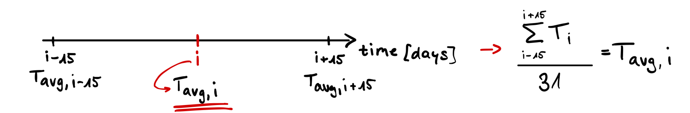
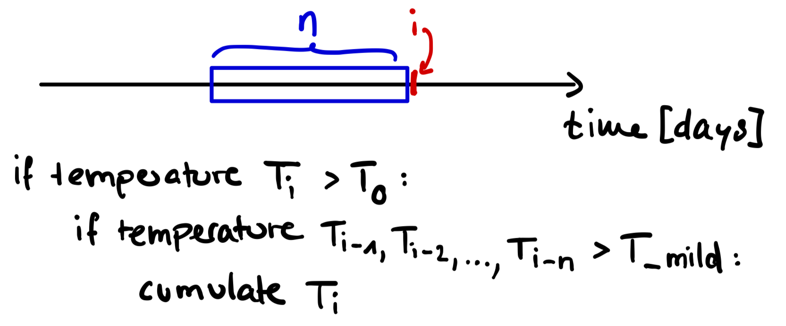

```{r setup, include=FALSE}
knitr::opts_chunk$set(echo = TRUE) 
```

Error in libgit2::git_signature_default : config value 'user.name' was not found --\> Resolved with: usethis::use_git_config(user.name = "lell-ski", user.email = "[196680295+lell-ski\@users.noreply.github.com](mailto:196680295+lell-ski@users.noreply.github.com){.email}")

## Get started

```{r}
#install.packages("phenocamr")
#install.packages("tidyterra")

# I will use the phenocamr package which 
# interfaces with the phenocam network API
# to download time series of vegetation 
# greenness and derived phenology metrics
library(phenocamr)
library(ggplot2)
library(tidyverse)
library(dplyr)
library(GenSA)
library(terra)
library(MODISTools)
library(tidyterra)
```

```{r}
# download greenness time series,
# calculate phenology (phenophases),
# amend with DAYMET data
# phenocamr::download_phenocam(
#   site = "harvard$",
#   veg_type = "DB",
#   roi_id = "1000",
#   daymet = TRUE,
#   phenophase = TRUE,
#   trim = 2022,
#   out_dir = "../data-raw/"
# )

harvard_phenocam_data <- readr::read_csv(
  file.path("../data-raw/", "harvard_DB_1000_3day.csv"), 
  comment = "#"
)

# reading in harvard phenology only retaining
# spring (rising) phenology for the GCC 90th
# percentile time series (the default)
harvard_phenology <- readr::read_csv(
  file.path(
    "../data-raw/",
    "harvard_DB_1000_3day_transition_dates.csv"
    ),
  comment = "#"
) |>
  dplyr::filter(
    direction == "rising",
    gcc_value == "gcc_90"
  )
```

**Comment** for personal Code understanding: The :: in "phenocamr::download_phenocam" specifies where the "download_phenocam" comes from. (idk about this example but) this is very important in terms of shadowing. When theres e.g. the Fn Filter() which is contained in the packages dplyr and Stats and i have loaded both packages, it is unclear from which package i wanna take the filter() fn. therefore i do dplyr::filter().

Plot GCC

```{r}
ggplot(harvard_phenocam_data) +
  geom_line(
    aes(
      as.Date(date),
      smooth_gcc_90
    ),
    colour = "grey25"
  ) +
  geom_point(
    data = harvard_phenology,
    aes(
      as.Date(transition_25),
      threshold_25
    )
  ) +
  labs(
    x = "",
    y = "GCC"
  ) +
  theme_bw() +
  theme(
    legend.position = "none"
  )
```

**Implement GDD Fn** (cumulative sum of temperatures above Threshhold T0 = 5°C)

```{r}
# return mean daily temperature as well
# as formal dates (for plotting)
harvard_temp <- harvard_phenocam_data |>
  group_by(year) |>
  dplyr::mutate(
    tmean = (tmax..deg.c. + tmin..deg.c.)/2
  ) |> 
  dplyr::mutate(
    date = as.Date(date),
    gdd = cumsum(ifelse(tmean >= 5, tmean - 5, 0))
  ) |>
  dplyr::select(
    date,
    year,
    tmean,
    gdd
  ) |>
  ungroup()

# convert the harvard phenology data and only
# retain required data
harvard_phenology <- harvard_phenology |>
  mutate(
    doy = as.numeric(format(as.Date(transition_25),"%j")),
    year = as.numeric(format(as.Date(transition_25),"%Y"))
  ) |>
  select(
    year,
    doy,
    transition_25,
    threshold_25
  )
```

**Comment** for personal unserstanding: \|\> (former %\>%) is the pipeline command that defines the order by which commands e.g. on a dataset should be executed. e.g. first filter the dataset, then isolate some values, then sort them etc. It saves the steps of doing the steps individually and after each step creating a new dataset with the new, saved changes (data1, data2, data3, ...).

**Plot the GDD**

```{r}
# grab only the 2010 value of spring phenology
harvard_phenology_2010 <- harvard_phenology |>
  dplyr::filter(
    year == 2010
  )

harvard_gdd_value <- harvard_temp |>
  dplyr::filter(
    date == harvard_phenology_2010$transition_25
  )

p <- ggplot(harvard_temp) +
  geom_line(
    aes(
      date,
      tmean
    )
  ) +
  geom_point(
    aes(
      date,
      tmean,
      colour = tmean > 5,
      group = 1
    )
  ) +
  geom_vline(
    data = harvard_phenology_2010,
    aes(
      xintercept = as.Date(transition_25)
    )
    ) +
  scale_colour_discrete(
    type = c(
      "blue",
      "red"
      )
  ) +
  labs(
    x = "",
    y = "Temperature (deg. C)"
  ) +
  xlim(
    c(
    as.Date("2010-01-01"),
    as.Date("2010-06-30")
    )
  ) +
  theme_bw() +
  theme(
    legend.position = "none"
  )

p2 <- ggplot(harvard_temp) +
  geom_line(
    aes(
      date,
      gdd
    )
  ) +
  geom_point(
    aes(
      date,
      gdd,
      colour = tmean > 5,
      group = 1
    )
  ) +
  scale_colour_discrete(
    type = c(
      "blue",
      "red"
      )
  ) +
  geom_vline(
    data = harvard_phenology_2010,
    aes(
      xintercept = as.Date(transition_25)
      )
    ) +
  geom_hline(
    data = harvard_gdd_value,
    aes(
      yintercept = gdd
    ),
    lty = 2
    ) +
  labs(
    x = "",
    y = "GDD (deg. C)"
  ) +
  xlim(
    c(
    as.Date("2010-01-01"),
    as.Date("2010-06-30")
    )
  ) +
  ylim(c(0, 1000)) +
  theme_bw()  +
  theme(
    legend.position = "none"
  )

# compositing
library(patchwork)
p + p2 + 
  plot_layout(ncol = 1) + 
  plot_annotation(
    tag_levels = "a",
    tag_prefix = "(",
    tag_suffix = ")"
    )
```

# 6.3 Growing degree day model optimization

Our GDD-based leaf-out model can be written in the form of a function that takes the temperature time series as its first argument, and as two parameters the temperature threshold above which temperatures are accumulated, and the critical GDD that determines the DOY at which leaf-out is predicted. Additionally, the s*pecific_weight* factoris introduced as 3rd parameter as improvement idea. It is further explained below the code chunk.

```{r}
gdd_model <- function(temp, par) {
  #print(length(temp))
  # split out parameters from a simple
  # vector of parameter values
  temp_threshold <- par[1]
  gdd_crit <- par[2]
  # weights
  weight_factor <- par[3]
  day_idx <- c(1:length(temp))
  # print(head(day_idx))
  specific_weight <- c(weight_factor*day_idx)
  # print(head(specific_weight))
  
  
  
  # accumulate growing degree days for
  # temperature data
  gdd <- cumsum((ifelse(temp > temp_threshold, temp - temp_threshold, 0))*specific_weight) 
  # print((gdd))
  
  # figure out when the number of growing
  # degree days exceeds the minimum value
  # required for leaf development, only
  # return the first value
  doy <- unlist(which(gdd >= gdd_crit)[1])
  
  return(doy)
}


```

## Own improvement (Ch. 8.2): Weighted temperatures

*The idea of my improvement is that the effect of a warm day on plants is depending on the proximity to the leave out day. For example, there are some warm days in January but then in February there is a cold snap again with maybe even snow cover and only in march the temperatures start to rise and stay constantly favorable for the plants. Then I assume that the warm days in January didn't contribute much to the growth of the plants in terms of the biological processes of the plant. However, they still contribute to the GDD. To account for that I introduced the specific_weight factor which increases linearly for every following day. If the mean temperature of a day is above the temperature threshold, it is multiplied by the specific_weight factor and the new, weighted value contributes to the GDD. This way, e.g. days in March contribute more towards the GDD than some warm January days.*

Running the model on the original 2010 data with the previously observed values and parameters 5C for the temperature threshold and 130.44C for the critical GDD, should yield a predicted leaf-out date that matches the observed leaf-out date of 114.

```{r}
# confirm that the model function
# returns expected results (i.e. DOY 114)
# (we filter out the year 2010, but
# removing the filter would run the
# model for all years!)
prediction <- harvard_temp |>
  dplyr::filter(
    year == 2010
  ) |>
  group_by(year) |>
  summarize(
    pred = gdd_model(
      temp = tmean,
      par = c(5, 130.44, 0.02)
    )  
  )
print(prediction)
```

### *Improvement comment:*

*I had to pass the 3rd parameter into the model run for 2010 because otherwise the DOY would return N/A. The other parameters (temperature threshold and GDD) were previously adjusted so that, with correct model implementation, they output exactly leave out day 114. If a third parameter is now added and the temperature threshold and GDD remain the same, the result will obviously not be doy 114 again, which is plausible given the context. Or another way to formulate it, it doesn't make sense wanting to obtain the predicted value of 114 with the newly introduced parameter.*

## 6.3.1 Phenology model calibration

To obtain accurate predictions across a larger set of years and sites, we estimate a general set of parameters for our growing degree day model, i.e., we calibrate the model parameters. To do so, we want to minimize the error (a cost function) between the model results (for a given set of parameters, i.e. the temperature threshold and critical GDD) and our observed data obtained for multiple sites and years.

```{r}
# run model and compare to true values
# returns the RMSE
rmse_gdd <- function(par, data) {
  
  # split out data
  drivers <- data$drivers
  validation <- data$validation
  
  # calculate phenology predictions
  # and put in a data frame
  predictions <- drivers |>
    group_by(year) |>
    summarise(
      predictions = gdd_model(
        temp = tmean,
        par = par
      )
    )
  
  predictions <- left_join(predictions, validation, by = "year")
  
  rmse <- predictions |>
    summarise(
      rmse = sqrt(mean((predictions - doy)^2, na.rm = TRUE))
    ) |>
    pull(rmse)
  
  # return rmse value
  return(rmse)
}
```

### Limit parameter space

Defining the limits of the parameter space well can significantly reduce the time needed to converge on a solution

```{r}
# starting model parameters
par = c(0, 130, 0)

# limits to the parameter space
lower <- c(-10,0,0)
upper <- c(45,500,1)

# data needs to be provided in a consistent
# single data file, a nested data structure
# will therefore accept non standard data formats
data <- list(
  drivers = harvard_temp,
  validation = harvard_phenology
  )

# optimize the model parameters
optim_par = GenSA::GenSA(
 par = par,
 fn = rmse_gdd,
 lower = lower,
 upper = upper,
 control = list(
   max.call = 4000 #4000
   ),
 data = data
)$par
print(optim_par)
```

### *Improvement comment:*

*I added a starting parameter and the limits for the 3rd parameter. Trying out a different upper limit and a different starting parameter yielded in differing optimized parameters and Scatterplots of DOY of observed and predicted leaf-out dates (DOY). However, after qualitatively vewing the differing results i didn't find another combination of starting and limit parameter that yielded a significantly better result in the scatterplot. One year fitted better with starting point x and another year fitted worse and i don't believe that the model would improve much by juggling these values. What would be more important is to see how the model would perform on unseen data.*

```{r}
# run the model for all years
# to get the phenology predictions
predictions <- harvard_temp |>
  group_by(year) |>
  summarize(
   prediction = gdd_model(
    temp = tmean,
    par = optim_par
  )  
  )
```

When looking at this small dataset for Harvard forest, we see a reasonable agreement between observed and predicted values (Figure 6.3). Obviously, including more sites and years would increase the model performance.

```{r}
# join predicted with observed data
validation <- left_join(predictions, harvard_phenology)

ggplot(validation) +
  geom_smooth(
    aes(
      doy,
      prediction
    ),
    colour = "grey25",
    method = "lm"
  ) +
  geom_point(
    aes(
      doy,
      prediction
    )
  ) +
  geom_abline(
    intercept=0, 
    slope=1, 
    linetype="dotted"
    ) +
  labs(
    x = "Observed leaf-out date (DOY)",
    y = "Predicted leaf-out date (DOY)"
  ) +
  theme_bw()  +
  theme(
    legend.position = "none"
  ) 
```

Figure 6.3: Scatterplot of observed and predicted leaf-out dates as day-of-year (DOY). A linear regression is overplot as a full dark grey line with confidence intervals shown as a light grey envelope.

### *Improvement comment:*

*From visually comparing the scatterplots of the original model with my improvement version it looks as if my model has less dots outside the CI and therefore the observed and predicted values agree better in the improvement model.*

## Further improvement ideas (8.2)

### Improvement idea 1: Weighted temperatures

Improvement idea 1 is introduced and commented on during [6.3 Growing degree day model optimization]. The respective paragraphs are clearly recognizable as they are highlighted with headings and in italics.

### Improvement idea 2: Model adapted to latitude

In the current implementation, January is the starting point of the DOY count. This works well for the northern hemisphere. However, for the southern hemisphere July might be a better starting point to reach DOY values that are comparable with the northern hemisphere. The improvement idea is to start the DOY count from the day in the coldest period. For that we would use a rolling mean to find the middle day (i) of the coldest period (n) (here: period n = 31 days). That way the model would be generalized over latitudes and also applicable for the southern hemisphere. The period (n) can be optimized to obtain the model that generalises best.



### Improvement idea 3: Only cumulate in mild periods

Similar to the implemented method the idea is that a few warm days within an otherwise cold period might not contribute a lot to the growth of plants but the model would still add the temperatures into the GCC. So, for example, i have a typically cold January but then there are a few days where there's a lot of sun and temperatures go beyond the threshold. However, this lasts for only a few days and then it's cold again for another 2 weeks and maybe we get another 2-3 days with mild temperatures followed by many successive cold days. So, i would want the model to include only warm days that appear in a generally mild period. This would mean that we would have to implement a condition inside the model where for day i the temperature Ti which is above threshold T0 (here T0 = 5°C) is only cumulated if the previous n days have temperatures Tn already above a specified temperature threshold (e.g. T_mild = 2°C). For example, if there's a day above T_0 it counts towards GCC if the preceding 7 days (n = 7) were above t_mild. Threshold t_mild as well as preceding days (n) can be optimized to obtain the model that generalises best.



# 6.4 Spatial scaling

As example we will use a region around Boston in the eastern United States, defined by the coordinates -72 to -70 East, and 42 to 44 North. First I download both minimum and maximum temperature data and average them to a mean daily value (as previously used), using the appeears R package (Hufkens 2023).

In case there are issues with creating a NASA user account or the download you can use:

```{r}
local_file <- tempfile(fileext = ".nc")
download.file("https://github.com/fabern/handfull_of_pixels/raw/refs/heads/main/data/DAYMET.004_2012/DAYMET.004_1km_aid0001.nc",
              destfile = local_file)
r1 <- terra::rast(local_file)
# Assign the correct CRS, e.g. WGS84 (EPSG:4326)
terra::crs(r1) <- "epsg:4326"
```

```{r}
# Calculate the daily mean values based on 'tmin' and 'tmax'
mean_layer <- terra::mean(r1["tmax"], 
                          r1["tmin"])
# fix the variable naming
varnames(mean_layer) <- "tmean"                             
names(mean_layer) <- gsub("tmax","tmean",names(mean_layer))
```

```{r}
terra::plot(mean_layer)
```

Figure 6.4: Daily mean temperature for the first 16 days of 2012 for the greater Boston area.

For convenience I limit the data to the first 180 days (layers) of the dataset to reduce the memory footprint of the calculations.

```{r}
# subset to first 180 days
ma_nh_temp <- terra::subset(
  mean_layer,
  1:180
)
```

One can then apply the model to this raster (cube) using the the terra::app() function and an appropriately formulated function, i.e. our growing degree day model gdd_model().

```{r}
predicted_phenology <- terra::app(
  ma_nh_temp,
  fun = gdd_model,
  par = optim_par
)
```

Plotting these results show a diverse response across the landscape, with higher elevation locations in the north west of the scene having a later leaf out date (in DOY) then coastal or urban areas (i.e. the greater Boston areas south east in the scene). This is both a reflection of the lapse rate as discussed in Chapter 4 and the urban heat island effect (Zhang, Friedl, and Schaaf 2004).

```{r}
library(leaflet)

# set te colour scale manually
pal <- colorNumeric(
  "magma",
  values(predicted_phenology),
  na.color = "transparent"
  )

# build the leaflet map
# using ESRI tile servers
# and the loaded demo raster
leaflet() |> 
  addProviderTiles(providers$Esri.WorldImagery, group = "World Imagery") |>
  addProviderTiles(providers$Esri.WorldTopoMap, group = "World Topo") |>
  addRasterImage(
    predicted_phenology,
    colors = pal,
    opacity = 0.8,
    group = "Phenology model results"
    ) |>
  addLayersControl(
    baseGroups = c("World Imagery","World Topo"),
    position = "topleft",
    options = layersControlOptions(collapsed = FALSE),
    overlayGroups = c("Phenology model results")
    ) |>
  addLegend(
    pal = pal,
    values = values(predicted_phenology),
    title = "DOY")
```

Figure 6.5: Interactive map of the spatially scaled optimized growing degree model using DAYMET daily mean temperature data for tile 11935, including the greater Boston area in the south-east to the White Mountains in the north-west.

## 6.4.1. Comparison with Modis MCD12Q2

Download and present Modis data according to Chapter 4 Phenology trends.

```{r}
# download and save phenology data
phenology <- MODISTools::mt_subset(
  product = "MCD12Q2",
  lat = 43,
  lon = -71,
  band = "Greenup.Num_Modes_01",
  start = "2012-01-01",
  end = "2012-12-31",
  km_lr = 100,
  km_ab = 100,
  site_name = "Greater Boston",
  internal = TRUE,
  progress = FALSE
)
```

```{r}
# screening of data
phenology <- phenology |>
  mutate(
    value = ifelse(value > 32656, NA, value),
    value = as.numeric(format(as.Date("1970-01-01") + value, "%j")),
    value = ifelse (value < 200, value, NA)
  )
```

```{r}
phenology_raster <- MODISTools::mt_to_terra(
  phenology,
  reproject = TRUE
)
```

```{r}
ggplot() +
  tidyterra::geom_spatraster(data = phenology_raster) +
  scale_fill_viridis_c(
    na.value = NA,
    name = "DOY"
    ) +
  theme_bw()
```

Figure 6.6: Map of the MODIS MCD12Q2 phenology product for the greater Boston area.

### Interpretation DAYMET model vs. MODIS MCD12Q2

**Creating boxplots to compare statistics**

```{r}
vals_modis <- as.vector(terra::values(phenology_raster))
vals_modis <- vals_modis[!is.na(vals_modis)]
summary(vals_modis)
boxplot(vals_modis, ylab = "MODIS observations (DOY)", main = "Modis output")
```

```{r}
vals_model <- as.vector(terra::values(predicted_phenology))
vals_model <- vals_model[!is.na(vals_model)]
summary(vals_model)
boxplot(vals_model, ylab = "Model leaf-out (DOY)", main = "Model output")

```

Comparing the DAYMET model (Fig. 6.5) that was built in this code with the Modis observations (Fig. 6.6), we can see that the range of DOY values is similar. However, the Modis data has DOY values starting earlier than the DAYMET model. When looking at the Modis boxplot it is visible that these low values are mostly outliers. It is interesting to note that the model has only outliers to the higher end and is right skewed while the Modis observations are not. When looking at the two medians, we see that they are not that much different. The median of the model output is approximately 10d later than the Modis observations. Our model therefore predicts leaf-out-days to be later than observed. A reason for this could be that the threshold T0 above which temperatures get summed up is too high. Another reason could be that the critical GDD value is too high. Finally, it could also be that the temperature weights I introduced in the model optimization process led to the DOY delay. This would mean that i underestimate the importance of warm events that are early in the year. Furthermore it should be noted that the urban heat island effect that is well depicted in the model output is not really visible in the modis output. This difference is most likely due to the model relying solely on temperature data while Modis reports greenness, which might be very noisy in an urban area. So, the model gives me a leaf-out day for every grid cell based on temperature, even if that grid cell is a parking lot and not vegetation. This could be another reason why the urban area looks so different in the two outputs. Furthermore, the spatial resolution of the modis could also have an impact in the urban area where different land cover classes might mix in the coarse resolution. When looking at the overall map, the modis data looks generally more noisy and there is less of a pattern visible than in the model output. This is likely due to the model working with a rather smooth temperature field and solely with temperature as input and not considering other factors that in reality influence leaf-out day and cause variability, such as water availability, different species, frost damage etc.

**Special Year 2010**

```{r}
print(prediction)
```

In year 2010 the predicted leaf out day was early because it was an unusually warm year (source: <https://www.nrcc.cornell.edu/services/blog/2011/01/04_2010_recap/index.html>)
